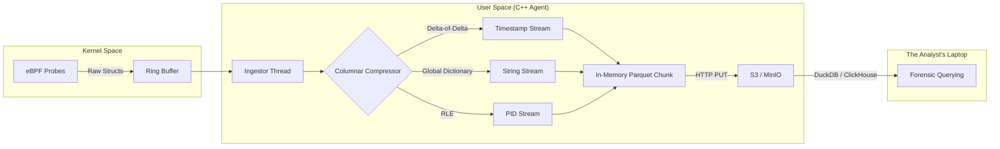

# EventHorizon

> **"The Black Box for Linux Infrastructure."**

  

**EventHorizon** is a high-performance, **Level 3 (L3)** observability agent designed to permanently decouple system telemetry from the host machine.

It operates on a radical philosophy: **You should never need to SSH into a production server.**

Instead of sampling metrics (CPU is 80%) or aggregating counters, EventHorizon records the **singular atomic events** of the Linux Kernel—process execution, file I/O, network handshakes, and memory allocations—compresses them using domain-specific columnar algorithms, and streams them instantly to object storage (S3).

---

## 🚀 The Core Philosophy: Level 3 Observability

Industry standard observability is "lossy." EventHorizon is **lossless**.

| Level | Type | Example | What you miss |
| :--- | :--- | :--- | :--- |
| **L1** | **Metrics** | `cpu_usage: 90%` | *Why* is it 90%? Which thread? |
| **L2** | **Logs/Tracing** | `nginx: 500 Error` | What system calls failed? Was it a permission error? |
| **L3** | **EventHorizon** | `PID 400 (nginx) calling openat() on /etc/ssl/certs failed (EACCES) at 12:00:01.004` | **Nothing.** |

---

## 🏗 Architecture

EventHorizon is strictly a **host-based agent**. It does **not** include a database.

It acts as a streaming engine that captures kernel events, compresses them into Parquet format, and offloads them immediately to your commodity object storage (S3, MinIO, GCS). You bring the storage and the query engine (DuckDB, ClickHouse, Athena).

---

## 🛡 Reliability: The "Immortal" Agent

Observability is useless if it fails when you need it most—during a system crash.

When a Linux machine is under massive load (Load Average > CPU Count), standard agents are starved of CPU time, causing them to drop events. EventHorizon prevents this by running as a **Real-Time Process**, utilizing two key Linux primitives:

1.  **SCHED_FIFO (Priority 99):** The kernel scheduler is instructed to prioritize EventHorizon above all standard userspace processes (databases, web servers, etc.). If an event occurs, we process it immediately.
2.  **mlockall (Memory Locking):** We lock the agent's entire address space into physical RAM. This prevents the OS from swapping the agent to disk during memory pressure conditions.

This "Immortal" status ensures that even if the host is effectively bricked due to load, the telemetry stream remains uninterrupted.